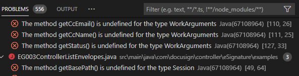
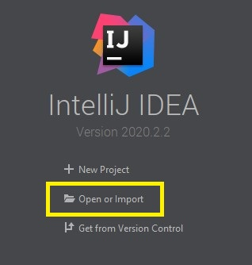

# Java Launcher Code Examples

Github repo: https://github.com/docusign/code-examples-java

This GitHub repo includes code example for the DocuSign eSignature REST API, for the DocuSign Rooms API and for the Click API. 

To use the Rooms API code examples, modify the **DS_API_NAME** setting at the end of the application.json file. Set the value to `ROOMS`.
To use the Click API code examples, modify the **DS_API_NAME** setting at the end of the application.json file. Set the value to `CLICK`.

**Note:** to use the Rooms API you must also [create your DocuSign Developer Account for Rooms](https://developers.docusign.com/docs/rooms-api/rooms101/create-account).

[](http://www.youtube.com/watch?v=XGpb861XQuA&t=3s "Java Quickstart")

## Introduction
This repo is a Java Spring Boot application that demonstrates how to authenticate with DocuSign via the
[Authorization Code Grant flow](https://developers.docusign.com/esign-rest-api/guides/authentication/oauth2-code-grant). When the token expires, the user is asked to reauthenticate. The refresh token is not used.

The [Spring Boot security Oauth2 boot autoconfigure package](https://github.com/spring-projects/spring-security-oauth2-boot/blob/master/spring-security-oauth2-autoconfigure/src/main/java/org/springframework/boot/autoconfigure/security/oauth2/resource/UserInfoRestTemplateCustomizer.java) is used for authentication.

The OAuth library is used in the file [WebSecurityConfig.java](https://github.com/docusign/code-examples-java/blob/master/src/main/java/com/docusign/WebSecurityConfig.java).

## eSignature API

For more information about the scopes used for obtaining authorization to use the eSignature API, see the [Required Scopes section](https://developers.docusign.com/docs/esign-rest-api/esign101/auth).


1. **Use embedded signing.**  
   [Source](./src/main/java/com/docusign/EG001ControllerEmbeddedSigning.java)
   This example sends an envelope, and then uses embedded signing for the first signer. With embedded signing, DocuSign signing is initiated from your website.
1. **Request a signature by email (Remote Signing).**  
   [Source](./src/main/java/com/docusign/controller/eSignature/examples/EG002ControllerSigningViaEmail.java) The envelope includes a pdf, Word, and HTML document.
   Anchor text ([AutoPlace](https://support.docusign.com/en/guides/AutoPlace-New-DocuSign-Experience)) is used to position the signing fields in the documents.
1. **List envelopes in the user's account.**  
   [Source](./src/main/java/com/docusign/controller/eSignature/examples/EG003ControllerListEnvelopes.java)
1. **Get an envelope's basic information.**  
   [Source](./src/main/java/com/docusign/controller/eSignature/examples/EG004ControllerEnvelopeInfo.java)
   The example lists the basic information about an envelope, including its overall status.
1. **List an envelope's recipients and their current status.**  
   [Source](./src/main/java/com/docusign/controller/eSignature/examples/EG005ControllerEnvelopeRecipients.java)
1. **List an envelope's documents.**  
   [Source](./src/main/java/com/docusign/controller/eSignature/examples/EG006ControllerEnvelopeDocs.java)
1. **Download an envelope's documents.**    
   [Source](./src/main/java/com/docusign/controller/eSignature/examples/EG007ControllerEnvelopeGetDoc.java) This example can download individual documents, the documents concatenated together, or a zip file of the documents.  
1. **Programmatically create a template.**  
   [Source](./src/main/java/com/docusign/controller/eSignature/examples/EG008ControllerCreateTemplate.java)  
1. **Request a signature by email using a template.**  
   [Source](./src/main/java/com/docusign/controller/eSignature/examples/EG009ControllerUseTemplate.java)  
1. **Send an envelope and upload its documents with multipart binary transfer.**  
   [Source](./src/main/java/com/docusign/controller/eSignature/examples/EG010ControllerSendBinaryDocs.java) Binary transfer is 33% more efficient than using Base64 encoding.  
1. **Use embedded sending.**  
   [Source](./src/main/java/com/docusign/controller/eSignature/examples/EG011ControllerEmbeddedSending.java)  
1. **Embedded DocuSign web tool (NDSE).**  
   [Source](./src/main/java/com/docusign/controller/eSignature/examples/EG012ControllerEmbeddedConsole.java)  
1. **Use embedded signing from a template with an added document.**  
   [Source](./src/main/java/com/docusign/controller/eSignature/examples/EG013ControllerAddDocToTemplate.java)
   This example sends an envelope based on a template. In addition to the template's document(s), the example adds an additional document to the envelope by using the [Composite Templates](https://developers.docusign.com/esign-rest-api/guides/features/templates#composite-templates) feature.  
1. **Payments example: an order form, with online payment by credit card.**  
   [Source](./src/main/java/com/docusign/controller/eSignature/examples/EG014ControllerCollectPayment.java)  
1. **Get the envelope tab data.**  
   [Source](./src/main/java/com/docusign/controller/eSignature/examples/EG015ControllerGetTabValues.java) Retrieve the tab (field) values for all of the envelope's recipients.  
1. **Set envelope tab values.**  
   [Source](./src/main/java/com/docusign/controller/eSignature/examples/EG016ControllerSetTabValues.java) The example creates an envelope and sets the initial values for its tabs (fields). Some of the tabs are set to be read-only, others can be updated by the recipient. The example also stores metadata with the envelope.  
1. **Set template tab values.**  
   [Source](./src/main/java/com/docusign/controller/eSignature/examples/EG017ControllerSetTemplateTabValues.java) The example creates an envelope using a template and sets the initial values or its tabs (fields). The example also stores metadata with the envelope.  
1. **Get the envelope custom field data (metadata).**  
   [Source](./src/main/java/com/docusign/controller/eSignature/examples/EG018ControllerEnvelopeCustomFieldValues.java) The example retrieves the custom metadata (custom data fields) stored with the envelope.  
1. **Requiring an Access Code for a Recipient**  
   [Source](./src/main/java/com/docusign/controller/eSignature/examples/EG019ControllerAccessCodeAuthentication.java)
   This example sends and envelope that requires an access-code for the purpose of multi-factor authentication.  
1. **Requiring SMS authentication for a recipient**  
   [Source](./src/main/java/com/docusign/controller/eSignature/examples/EG020ControllerSmsAuthentication.java) This example sends and envelope that requires entering in a six digit code from an text message for the purpose of multi-factor authentication.  
1. **Requiring Phone authentication for a recipient**  
   [Source](./src/main/java/com/docusign/controller/eSignature/examples/EG021ControllerPhoneAuthentication.java) This example sends and envelope that requires entering in a voice-based response code for the purpose of multi-factor authentication.  
1. **Requiring Knowledge-Based Authentication (KBA) for a Recipient**  
   [Source](./src/main/java/com/docusign/controller/eSignature/examples/EG022ControllerKBAAuthentication.java) This example sends and envelope that requires passing a Public records check to validate identity for the purpose of multi-factor authentication.  
1. **Requiring ID Verification (IDV) for a recipient**  
    [Source](./src/main/java/com/docusign/controller/eSignature/examples/EG023ControllerIdvAuthentication.java) This example sends and envelope that requires the recipient to upload a government issued id.  
1. **Creating a permission profile**  
   [Source](./src/main/java/com/docusign/controller/eSignature/examples/EG024ControllerPermissionCreate.java) This code example demonstrates how to create a user group's permission profile using the [Create Profile](https://developers.docusign.com/esign-rest-api/reference/UserGroups/Groups/create) method.  
1. **Setting a permission profile**  
   [Source](./src/main/java/com/docusign/controller/eSignature/examples/EG025ControllerPermissionSetUserGroups.java) This code example demonstrates how to set a user group's permission profile using the [Update Group](https://developers.docusign.com/esign-rest-api/reference/UserGroups/Groups/update) method. You must have already created permissions profile and group of users.  
1. **Updating individual permission settings**  
   [Source](./src/main/java/com/docusign/controller/eSignature/examples/EG026ControllerPermissionChangeSingleSetting.java) This code example demonstrates how to update individual settings for a specific permission profile using the [Update Permission Profile](https://developers.docusign.com/esign-rest-api/reference/Accounts/AccountPermissionProfiles/update) method. You must have already created permissions profile and group of users.  
1. **Deleting a permission profile**  
   [Source](./src/main/java/com/docusign/controller/eSignature/examples/EG027ControllerPermissionDelete.java)
   This code example demonstrates how to an account's permission profile using the [Delete AccountPermissionProfiles](https://developers.docusign.com/esign-rest-api/reference/Accounts/AccountPermissionProfiles/delete) method. 
1. **Creating a brand**  
   [Source](./src/main/java/com/docusign/controller/eSignature/examples/EG028ControllerCreateBrand.java)
   This example creates brand profile for an account using the [Create Brand](https://developers.docusign.com/esign-rest-api/reference/Accounts/AccountBrands/create) method.
1. **Applying a brand to an envelope**  
   [Source](./src/main/java/com/docusign/controller/eSignature/examples/EG029ControllerApplyBrandToEnvelope.java) This code example demonstrates how to apply a brand you've created to an envelope using the [Create Envelope](https://developers.docusign.com/esign-rest-api/reference/Envelopes/Envelopes/create) method. 
   First, creates the envelope and then applies brand to it.
   Anchor text ([AutoPlace](https://support.docusign.com/en/guides/AutoPlace-New-DocuSign-Experience)) is used to position the signing fields in the documents.
1. **Applying a brand to a template**
   [Source](./src/main/java/com/docusign/controller/eSignature/examples/EG030ControllerApplyBrandToTemplate.java) This code example demonstrates how to apply a brand you've created to a template using using the [Create Envelope](https://developers.docusign.com/esign-rest-api/reference/Envelopes/Envelopes/create) method. You must have at least one created template and brand.  
1. **Bulk sending envelopes to multiple recipients**  
   [Source](./src/main/java/com/docusign/controller/eSignature/examples/EG031ControllerBulkSendEnvelopes.java) This example creates and sends a bulk envelope by generating a bulk recipient list and initiating a bulk send.
1. **Pausing a signature workflow Source**  
   [Source](./src/main/java/com/docusign/controller/eSignature/examples/EG032ControllerPauseSignatureWorkflow.java) This code example demonstrates how to create an envelope where the workflow is paused before the envelope is sent to a second recipient.
1. **Unpausing a signature workflow**  
   [Source](./src/main/java/com/docusign/controller/eSignature/examples/EG033ControllerUnpauseSignatureWorkflow.java) This code example demonstrates how to resume an envelope workflow that has been paused
1. **Use conditional recipients**  
   [Source](./src/main/java/com/docusign/controller/eSignature/examples/EG034ControllerUseConditionalRecipients.java) This code example demonstrates how to create an envelope where the workflow is paused before the envelope is sent to a second recipient.
1. **Request a signature by SMS delivery**  
   [Source](./src/main/java/com/docusign/controller/eSignature/examples/EG035ControllerSMSDelivery.java) This code example demonstrates how to send a signature request via an SMS message using the [Envelopes: create](https://developers.docusign.com/esign-rest-api/reference/Envelopes/Envelopes/create) method. 

## Rooms API 

For more information about the scopes used for obtaining authorization to use the Rooms API, see the [Required Scopes section](https://developers.docusign.com/docs/rooms-api/rooms101/auth/).

**Note:** To use the Rooms API you must also [create your DocuSign Developer Account for Rooms](https://developers.docusign.com/docs/rooms-api/rooms101/create-account). Examples 4 and 6 require that you have the DocuSign Forms feature enabled in your Rooms for Real Estate account.


1. **Create room with Data.**  
   [Source](./src/main/java/com/docusign/controller/rooms/examples/R001ControllerCreateRoom.java)
   This code example creates a new room in your DocuSign Rooms account to be used for a transaction.
1. **Create a room from a template.**  
   [Source](./src/main/java/com/docusign/controller/rooms/examples/R002ControllerCreateRoomWithTemplate.java)
   This code example creates a new room using a template.
1. **Create room with Data.**  
   [Source](./src/main/java/com/docusign/controller/rooms/examples/R003ControllerExportingDataFromRoom.java)
   This code example exports all the avialalble data from a specific room in your DocuSign Rooms account.
1. **Add forms to a room.**  
   [Source](./src/main/java/com/docusign/controller/rooms/examples/R004ControllerAddingFormsToRoom.java)
   This code example adds a standard real estate related form to a specific room in your DocuSign Rooms account.
1. **How to search for rooms with filters.**  
   [Source](./src/main/java/com/docusign/controller/rooms/examples/R005ControllerGetRoomsWithFilters.java)
   This code example searches for rooms in your DocuSign Rooms account using a specific filter. 
1. **Create an external form fillable session.**  
   [Source](./src/main/java/com/docusign/controller/rooms/examples/R006ControllerCreateExternalFormFillSession.java)
   This code example create an external form that can be filled using DocuSign for a specific room in your DocuSign Rooms account.
   This example create an external form that can be filled using DocuSign for a specific room in your DocuSign Rooms account.
1. **Create a form group.**
   [Source.](./src/main/java/com/docusign/controller/rooms/examples/R007ControllerCreateFormGroup.java)
   This code example create a form group for your DocuSign Rooms for Real Estate account.
1. **Grant office access to a form group.**
   [Source.](./src/main/java/com/docusign/controller/rooms/examples/R008ControllerGrantOfficeAccessToFormGroup.java)
   This code example assign an office to a form group for your DocuSign Rooms for Real Estate account. 
   Granting office access to a form group will enable you to filter which form groups are available based on that office.
1. **Assign a form to a form group.**
   [Source.](./src/main/java/com/docusign/controller/rooms/examples/R009ControllerAssignFormToFormGroup.java)
   This example demonstrates how to assign a form to a form group for your DocuSign Rooms for Real 
   Estate account. As a prerequisite, ensure that you have created a form group and set the 
   office ID on this form group before proceeding.

## Click API  
For more information about the scopes used for obtaining authorization to use the Click API, see the [Required Scopes section](https://developers.docusign.com/docs/click-api/click101/auth/)  
  
1. **Create Clickwraps.**  
   [Source](./src/main/java/com/docusign/controller/click/examples/C001ControllerCreateClickwrap.java) This code example shows how to create a clickwrap.
1. **Activate Clickwrap.**  
   [Source](./src/main/java/com/docusign/controller/click/examples/C002ControllerActivateClickwrap.java)
   This code example shows how to activate a new clickwrap that you have already created.
1. **Clickwrap Versioning.**  
   [Source](./src/main/java/com/docusign/controller/click/examples/C003ControllerCreateNewVersionClickwrap.java)
   This code example shows how to create a new clickwrap version.
1. **Get a list of Clickwraps.**  
   [Source](./src/main/java/com/docusign/controller/click/examples/C004ControllerGetListClickwraps.java)
   This code example shows how to get a list of clickwraps.
1. **Get Clickwrap Responses.**  
   [Source](./src/main/java/com/docusign/controller/click/examples/C005ControllerGetClickwrapResponses.java)
   This code example shows how to get clickwrap responses.

## Included OAuth grant types:

* Authentication with Docusign via [Authorization Code Grant flow](https://developers.docusign.com/platform/auth/authcode) .
When the token expires, the user is asked to re-authenticate.
The **refresh token** is not used in this example.

* Authentication with DocuSign via the [JSON Web Token (JWT) Grant](https://developers.docusign.com/platform/auth/jwt/).
When the token expires, it updates automatically.

   **Note:** Before you can make any API calls using JWT Grant, you must get your user’s consent for your app to impersonate them. To do this, the `impersonation` scope is added when requesting a JSON Web Token.


## Installation

### Prerequisites
**Note: If you downloaded this code using Quickstart from the DocuSign Developer Center, skip step 2 below as it is automatically performed for you.**  

1. A DocuSign developer account (email and password) on [demo.docusign.net](https://demo.docusign.net).
   Create a [free account](https://go.docusign.com/sandbox/productshot/?elqCampaignId=16533).
1. A DocuSign Integration Key (a client ID) that is configured to use the
   OAuth Authorization Code flow.
   You will need the **Integration Key** itself, and its **secret**. To
   use JSON Web token, you will need the **Integration Key** itself, the
   **RSA Secret Key** and an API user ID for the user you are impersonating.  

   If you use this launcher on your own workstation,
   the Integration key must include following **Redirect URI**s:
   * http://localhost:8080/login&type=acg
   * http://localhost:8080/login&type=jwt

   If you will not be running the launcher on your own workstation,
   use the appropriate DNS name and port instead of `localhost:8080`.
   A sample Redirect URI: http://myserver.it.mycompany.com/login

1. [JDK 11](https://jdk.java.net/java-se-ri/11) or later
1. [Maven](https://maven.apache.org/download.cgi)
1. A name and email for a signer, and a name and email for a cc recipient.
   The signer and the cc email cannot be the same.
1. **Optional** [Lombok Annotations Processing](https://www.baeldung.com/lombok-ide) configured for your IDE. 


#### Authorization Code Grant specifics:
   You will need the integration key and its secret. The integration key must include a redirect URI of

   {app_url}/login&type=acg
   where {app_url} is the URL you have associated with the folder where the source files are located.
   For example, if you have created a web server that enables the URL

   http://localhost:8080/

   to execute files on the /public folder of this example, then you must add a redirect URI to your integration key with the value
   http://localhost:8080/login&type=acg

#### JWT (JSON Web Token) specifics:
   You will need the integration key, an RSA private key, and the user ID (GUID) of the impersonated user.
   The private part of the RSA key pair must be copied over and stored in a private.key file located in `src\main\resources\private.key`.

   **Note:** Before you can make any API calls using JWT Grant, you must get your user’s consent for your app to impersonate them. To do this, the `impersonation` scope is added when requesting a JSON Web Token.


### Installation steps
1. Download or clone this repository.
1. The project includes a Maven pom file.   

**Note: If you downloaded this code using Quickstart from the DocuSign Developer Center, skip the next step as it was automatically performed for you.**  
1.  Configure the project by overriding necessary properties from the `src\main\resources\application.example.json` and saving this file as `application.json` file. **Don't add this file into the Git index.**  
1. Add VM argument `-Dspring.profiles.active=dev` to your IDE
1. Note that IntelliJ IDEA Community Edition does not directly support
  Spring Boot applications.  
1. [Optional] Install Lombok for your IDE (See the IntelliJ or Eclipse instructions below for specific details). 

**NOTE:** If Lombok Annotations Processing is not installed in your IDE, you will see several errors regarding undefined methods. These methods are generated at compile time and do not otherwise impact the functionality of the launcher.

  
  
### Build and run
Launchers are built as a dedicated application with embedded TomCat server. Build:  
``` bash
$ cd code-examples-java
$ mvn package
```
Run:  
``` bash
$ java -Dspring.profiles.active=dev -jar target/code-examples-java-1.0-SNAPSHOT.war
```

## IntelliJ Ultimate instructions for Windows
The [IntelliJ IDE Ultimate edition](https://www.jetbrains.com/idea/) can be used with the launcher. The IntelliJ Ultimate edition is required due to its support for Spring Boot and JSP view pages.

**Note: If you downloaded this code using Quickstart from the DocuSign Developer Center, skip Steps 1 and 2 as they were automatically performed for you.**  
1.  Download or clone the
[code-examples-java](https://github.com/docusign/code-examples-java)
   repository.  
1.  Open the src\main\resources\application.example.json file.  
Configure the launcher by pasting the following data from your DocuSign developer account [Apps and Keys](https://admindemo.docusign.com/authenticate?goTo=apiIntegratorKey) page:  
`DS_SIGNER_NAME` (a string value for the Signer's name)  
`DS_SIGNER_EMAIL` (a string value for the Signer's email address)  
`DS_TARGET_ACCOUNT_ID` (the **API Username** in the **Apps and Keys** page)  
`authorization.code.grant.client.client-id` (**Integration Key**)   
`authorization.code.grant.client.client-secret` (Select the **Actions** button to the right of your **Integration Key** > **Edit** > **Authentication** > **+ ADD SECRET KEY** > **Secret Key**)   
`jwt.grant.client.client-id` (**Integration Key**)   
`wt.grant.client.impersonated-user-guid` (**API Username**)   
Save this file as `application.json`  
**Don't add this application.json file to your GitHub repo since it contains personal information.**  
1.   Start IntelliJ Ultimate and choose the **Open or Import** option.  
  
1.   Use the popup file chooser to select 
**code-examples-java** or your unzipped Quickstart directory.
1.   The **Import Project** wizard will open. It's a
series of screens. On the first screen, select
**Import project from external model** and **Maven**.

1.   Click **Finish** and the project will
be displayed in the IDE.

### Configuring IntelliJ's *Run/Debug Configuration*
IntelliJ uses **Run/Debug Configuration** to manage
settings for running the launcher.

Set up a Run/Debug Configuration for the launcher:

1. Use the menu command **Run > Edit configurations...**  
to open the configuration manager.

1. Click the **+** (plus) sign to add a new configuration.
The configuration type is **Spring Boot**. You may need to
open the additional templates section of the template chooser.

1. Update the form with the **Name** of the
configuration to `code-examples-java` and the **Main class** for the configuration,
`com.docusign.App` **Tip:** use the **...**   (ellipses) button next to the field to choose the Main class.

Under **Spring Boot** select the `Enable debug output` checkbox.

Select the **OK** button.


### Running or debugging the launcher

Use a **Run** menu option to run or debug the launcher.

After the application finishes building, open your browser to http://localhost:8080


### [Optional] Installing Lombok

Click File, then Settings. From there select `Plugins`. Open the Marketplace tab and type **Lombok**. It should have an author named Michail Plushnikov. Click install then restart IntelliJ.  


## Eclipse instructions
**Note: If you downloaded this code using Quickstart from the DocuSign Developer Center, skip Steps 1, 2, and 4.** 
1.  Download or clone the
[code-examples-java](https://github.com/docusign/code-examples-java)
   repository.  
1.  Open the src\main\resources\application.example.json file.  
Configure the launcher by pasting the following data from your DocuSign developer account [Apps and Keys](https://admindemo.docusign.com/authenticate?goTo=apiIntegratorKey) page:  
`DS_SIGNER_NAME` (a string value for the Signer's name)  
`DS_SIGNER_EMAIL` (a string value for the Signer's email address)  
`DS_TARGET_ACCOUNT_ID` (the **API Username** in the **Apps and Keys** page)  
`authorization.code.grant.client.client-id` (**Integration Key**)   
`authorization.code.grant.client.client-secret` (Select the **Actions** button to the right of your **Integration Key** > **Edit** > **Authentication** > **+ ADD SECRET KEY** > **Secret Key**)   
`jwt.grant.client.client-id` (**Integration Key**)   
`wt.grant.client.impersonated-user-guid` (**API Username**)   
Save this file as `application.json`  
**Don't add this application.json file to your GitHub repo since it contains personal information.**  

1. Open Eclipse and select import. When the window appears, select the Maven folder, then select **Existing Maven Project**, and **Browse** for your Quickstart folder name or code-examples-java. 
   1. Under **Projects**, the **pom.xml** file should be selected. 
   1. Select the **Add project(s) to working set** checkbox to save the project link to your Eclipse workspace. Select **Finish**.
3. Next, select **Run**, then **Run Configurations**, and right-click **Maven Build**, then **New Configuration** to clean and compile:
   1. In the **Name** field, input: `build`
   1. In **Base Directory**, input: `${workspace_loc:/code-examples-java}`
   1. In **Goals**, input: `clean package`
   1. Select the **JRE** tab. Under **Runtime JRE**, ensure it lists jdk-11 or higher. Select **Apply** to save.
4. In the **Run Configurations** dialog box, in the left sidebar, right-click **Java Application**, then **New Configuration**:  
   1. In the **Name** field, input: `App`
   1. In the **Project** field, input: `code-examples-java`
   1. In the **Main class** field, input: `com.docusign.App`
   1. Select the **JRE** tab. Under **Runtime JRE**, ensure it lists jdk-11 or higher. Select **Apply** to save.
   1. Select **Run** to run the launcher. A browser window should automatically open to the consent page.
5. [Optional] Download the [lombok.jar](https://projectlombok.org/downloads/lombok.jar) to your local machine. To install Lombok, open a terminal or command line. Run `java -jar lombok.jar`  


### Payments code example  
To use the payments example, create a test payments gateway for your developer account. See the [PAYMENTS_INSTALLATION.md](https://github.com/docusign/code-examples-java/blob/master/PAYMENTS_INSTALLATION.md) file for instructions.

Then add the payment gateway account id to the **application.json** file.


## License and additional information  

### License  
This repository uses the MIT License. See the LICENSE file for more information.

### Pull Requests
Pull requests are welcomed. Pull requests will only be considered if their content
uses the MIT License.
