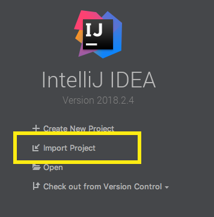
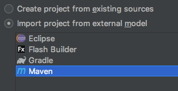
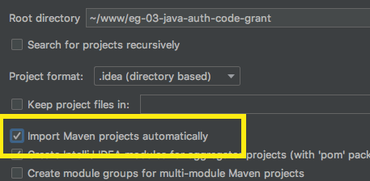
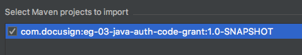
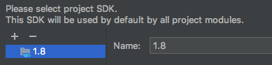
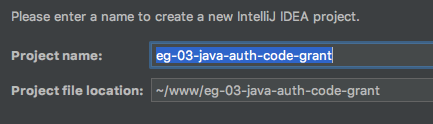
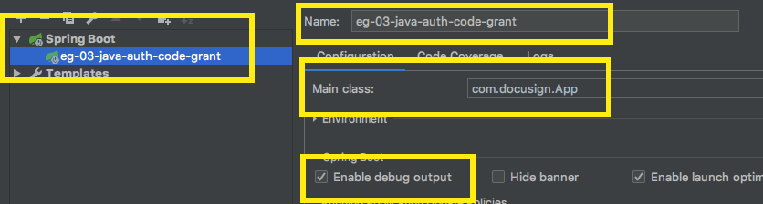

# IntelliJ installation

The [IntelliJ IDE Ultimate edition](https://www.jetbrains.com/idea/)
can be used with the example. The IntelliJ Ultimate edition is
required due to its support for Spring Boot and JSP view pages.

**Step 1.** Download or clone the
[eg-03-java-auth-code-grant](https://github.com/docusign/eg-03-java-auth-code-grant)
   repository

**Step 2.** Start IntelliJ Ultimate and choose the **Import Project** option.

**Step 3.** Use the popup file chooser to select the
**eg-03-java-auth-code-grant** directory.

**Step 4.** The **Import Project** wizard will open. It's a
series of screens. On the first screen, select
**Import project from external model** and **Maven**.

**Step 5.** Check the **Import Maven projects automatically** line.

**Step 6.** Select the example project.

**Step 7.** Select Java 1.8 or later.

**Step 8.** Enter the project's name.

**Step 9.** Click **Finish** and the project will
be displayed in the IDE.

## Configuring the project
Configure the example as discussed in the repository's Readme.

## Running the example

### Configuring the IDE's *Run/Debug Configuration*
IntelliJ uses **Run/Debug Configurations** to manage
settings for running the example.

**One time:** setup a Run/Debug Configuration for the example:

Step 1. Use the menu command **Run / Edit configurations...**
to open the configuration manager.

Step 2. Click the **+** (plus) sign to add a new configuration.
The configuration type is **Spring Boot**. You may need to
open the additional templates section of the template chooser.

Step 3. Update the form with the **Name** of the
configuration and the **Main class** for the configuration,
`com.docusign.App` **Tip:** use the **...** (ellipses) button next to the field to choose the Main class.

Tip: check the **Enable debug output** checkbox.

### Running or debugging the example

Use a **Run** menu option to run or debug the example.

After the application is ready for requests, open your
browser to http://localhost:8080
